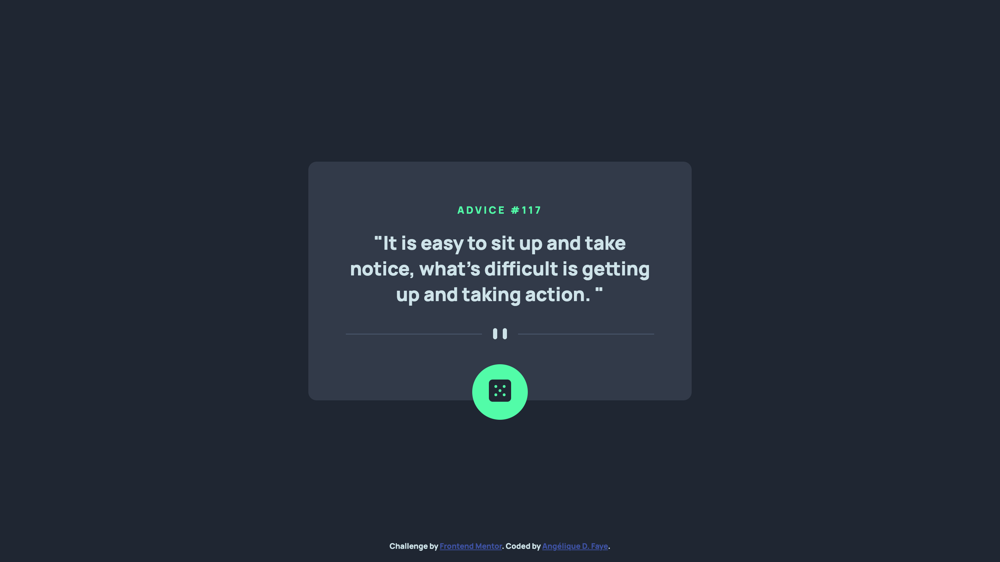

# Advice generator app challenge

  
  
  
  

## Overview

_An app to get inspired._

 

## Links

<a href="https://github.com/AngeliqueDF/advice-generator-challenge">GitHub repo</a> • 
<a href="https://symphonious-profiterole-31bf3c.netlify.app/">Live demo</a>

 

## How to run the project

1. `git clone https://github.com/AngeliqueDF/advice-generator-challenge.git MY-FOLDER-NAME`
2. `cd MY-FOLDER-NAME`
3. `npm install`
4. `npm start`
5. visit `http://localhost:1234`

or

1. `npm run dev`
2. Keep an eye on the console and reload the browser if necessary. The live reload server sometimes disconnects on its own.

### Check out the other branches!

- Branch `main` solves the challenge with the `async/await` syntax.
- Branch `solved-with-promise-chaining` solves the challenge with promise chaining.
- Branch `solved-with-jquery-ajax` solves the challenge with `jquery`.

 

## The challenge

> Your challenge is to build out this advice generator app using the [Advice Slip API](https://api.adviceslip.com) and get it looking as close to the design as possible.
>
> You can use any tools you like to help you complete the challenge. So if you've got something you'd like to practice, feel free to give it a go.
>
> Your users should be able to:
>
> - View the optimal layout for the app depending on their device's screen size
> - See hover states for all interactive elements on the page
> - Generate a new piece of advice by clicking the dice icon
>
> _[From Frontend Mentor]()_

 

## Description

This frontend project is a good way to practice connecting to an API and render data received to the DOM.

 

## How I built this project

1.  Started by structuring the page with semantic and accessible HTML.
2.  Styled the page with a mobile-first approach.
3.  Added functionality with JavaScript.

 

## Features

- When the dice is clicked, the app displays a new advice from the Advice Slip API.
- Responsive interface.
- Lightweight.

 

## Technologies

- Semantic `HTML5` markup.
- `SCSS`.
- `Flexbox`.
- Mobile-first workflow.
- Minified with `parcel` (v2).

 

## How I built this project

1.  Start by structuring the page with semantic and accessible HTML.
2.  Style the page with a mobile-first approach.
3.  Add functionality with JavaScript.

 

## Sources

- [Advice generator app from Frontend Mentor.](https://www.frontendmentor.io/challenges/advice-generator-app-QdUG-13db)
